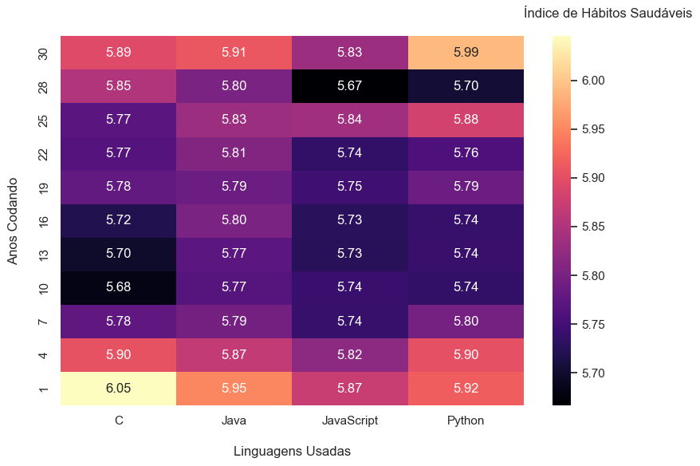
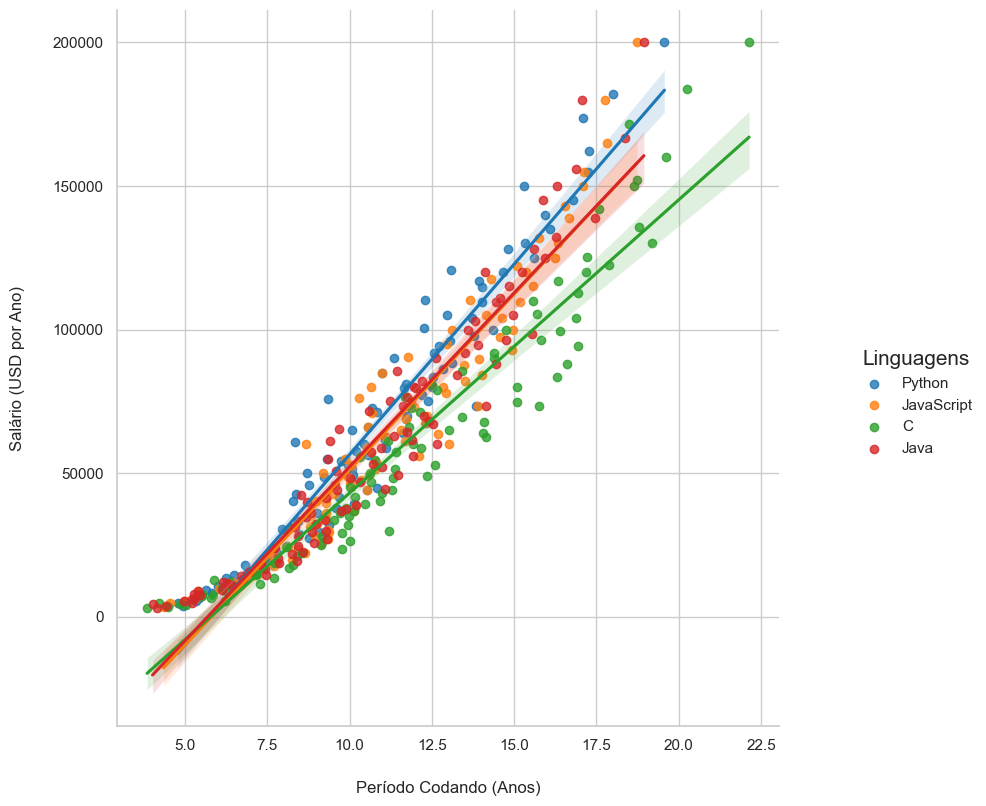
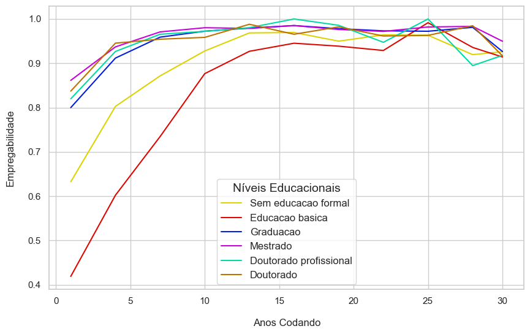
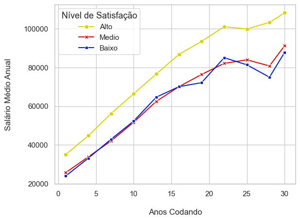

# A1-LP-2024

## Plotagens:

Nesta seção, apresentaremos as visualizações gráficas que ilustram os dados analisados para cada hipótese do projeto. As plotagens são ferramentas fundamentais para explorar e entender os padrões nos dados, facilitando a interpretação e extração de insights. Para cada hipótese, utilizaremos diferentes tipos de gráficos adequados para destacar as relações e tendências presentes.

* **Hipótese 1:** Índices de Hábitos Saudáveis entre Programadores.
  
  Para esta hipótese, utilizamos um heatmap (mapa de calor) onde o eixo X representa as faixas de anos de experiência e o eixo Y as linguagens de programação ("C", "Java", "JavaScript" e "Python"). O gradiente de cores reflete o índice de saúde, permitindo a visualização de como esse índice varia em função do tempo de experiência e da linguagem utilizada.

  Essa forma de visualização foi escolhida porque o uso do gradiente facilita a identificação de padrões. Assim, é possível obter uma visão clara de como diferentes grupos se comportam com relação ao índice de saúde conforme a experiência e a linguagem de programação.

  

  
* **Hipótese 2:** Crescimento Salarial entre Programadores de Python e Java/C
   
   Para a hipótese 2, utilizamos um gráfico de dispersão para analisar os dados salariais de programadores, divididos em grupos conforme as linguagens de programação em seu repertório: Python, JavaScript, C, Java ou aqueles que utilizam duas ou mais dessas linguagens. No gráfico, o eixo X representa os anos de experiência e o eixo Y o salário anual (em USD). Adicionamos uma linha de tendência para cada grupo, facilitando a comparação do crescimento salarial ao longo do tempo.

   A escolha do gráfico de dispersão foi feita porque ele permite uma análise clara da relação entre multivariáveis contínuas, no caso, o tempo de experiência e o salário. Além disso, a dispersão dos pontos proporciona uma visão detalhada das variações individuais dentro de cada grupo, enquanto as linhas de tendência auxiliam na identificação de padrões gerais de crescimento salarial ao longo do tempo.
 

  

* **Hipótese 3:** Grau de Formação e Empregabilidade.

   A escolha do gráfico de linhas para a hipótese 3 se justifica pela sua capacidade de representar visualmente dados contínuos e a evolução de variáveis ao longo do tempo. Neste contexto, utilizamos o gráfico para ilustrar a proporção de programadores empregados em relação ao total, categorizando-os conforme seu grau de formação. O eixo X representa a experiência em anos, enquanto o eixo Y quantifica a proporção de empregabilidade.
   
   Essa representação permite não apenas a observação de tendências e padrões na empregabilidade em diferentes níveis de formação, mas também a identificação de possíveis correlações entre a experiência e a empregabilidade. A suavização das linhas facilita a visualização das flutuações nos dados, permitindo uma análise mais clara de como cada grau de formação pode impactar a empregabilidade ao longo da carreira profissional.

  

 

* **Hipótese 4:** Formação Superior e Domínio de Linguagens de Programação.

Para a hipótese 4, utilizamos um gráfico de linhas com marcadores para investigar a relação entre a satisfação na carreira e os níveis salariais de programadores. Os dados foram organizados com base nos anos de experiência e divididos em três grupos conforme os níveis de satisfação profissional (alta, média e baixa). No gráfico, o eixo X representa os anos de experiência e o eixo Y mostra o salário médio. As três linhas correspondem aos níveis de satisfação, permitindo uma análise comparativa de como os salários evoluem ao longo da carreira em função da satisfação.

A escolha do gráfico de linhas se justifica por sua capacidade de representar tendências ao longo do tempo, facilitando a visualização das diferenças salariais entre os grupos. Essa abordagem permite identificar como a satisfação na carreira pode impactar o crescimento salarial ao longo da trajetória profissional.

  

 

## Testes:

Nesta seção, serão tratados os testes utilizados para verificar os principais métodos de nosso código. Todas as principais funções foram devidamente testadas e aplicadas em seu fim último com sucesso, mas por redundância, foram elaborados testes a fim de testar as funções em casos mais gerais e isolados que envolvam problemáticas semelhantes.

Todos os arquivos relacionados aos testes estão no diretório `\tests`. Nele estão contidos os arquivos `tests_main.py`,`tests_manip_csv.py`, `tests_prep_vizu.py`, `tests_trat_dados.py` e o subdiretório `arquivos_testes`  

**O arquivo `tests_main.py`** executa todos os demais testes de uma só vez. Basta executá-lo. 

Caso queira executar um determinado grupo de testes separado, há três opções:

**O arquivo `tests_manip_csv.py`** trata dos testes atrelados ao arquivo `src\manipulacao_csv.py`, que consiste em funções que tratam de receber um arquivo CSV e realizar sua leitura e conversão para um DataFrame em Pandas. Aqui são utilizados os arquivos do diretório `arquivos_testes`, que contem alguns arquivos em CSV com diferentes variações para que sejam testadas as capacidades de leitura e análise desses arquivos mediantes certas circunstâncias.

**O arquivo `tests_trat_dados.py`** trata dos testes atrelados ao arquivo `src\tratamento_dados.py` que contém funções que manipulam DataFrames Pandas para atualizar dados, limpá-los e permitir sua análise. 

**O arquivo `tests_prep_vizu.py`** trata dos testes atrelados ao arquivo `src\preparacao_visualizacao.py` que contém funções que, a partir das bases de dados preparadas, criam os indicadores utilizados na Análise Exploratória e na plotagem dos gráficos, que serão fundamentais para a conclusão do trabalho

