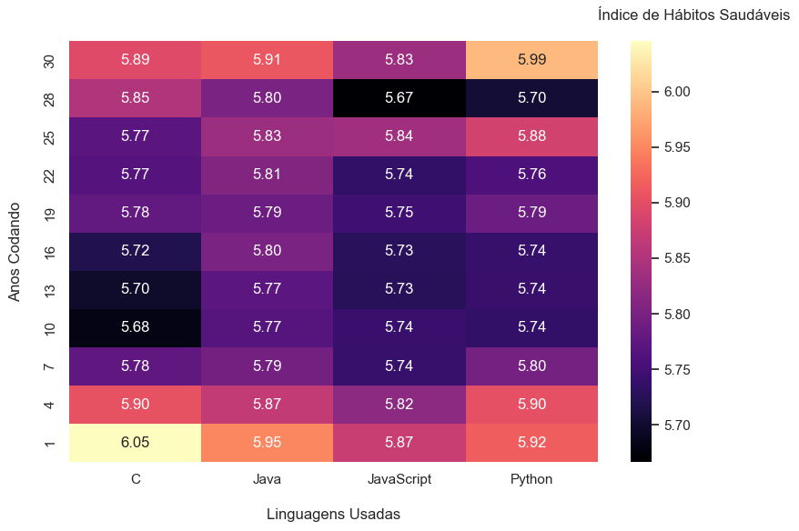
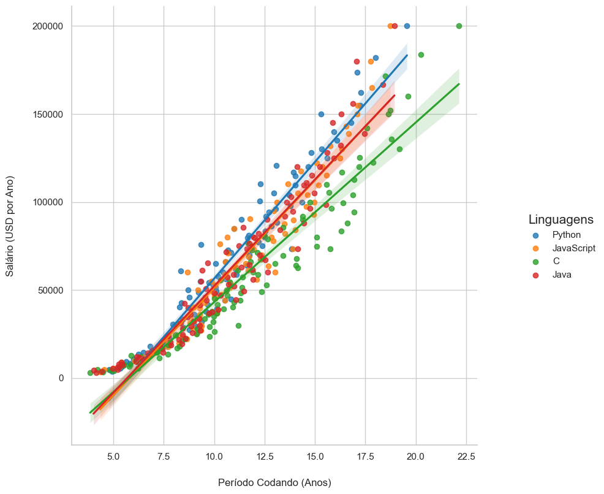
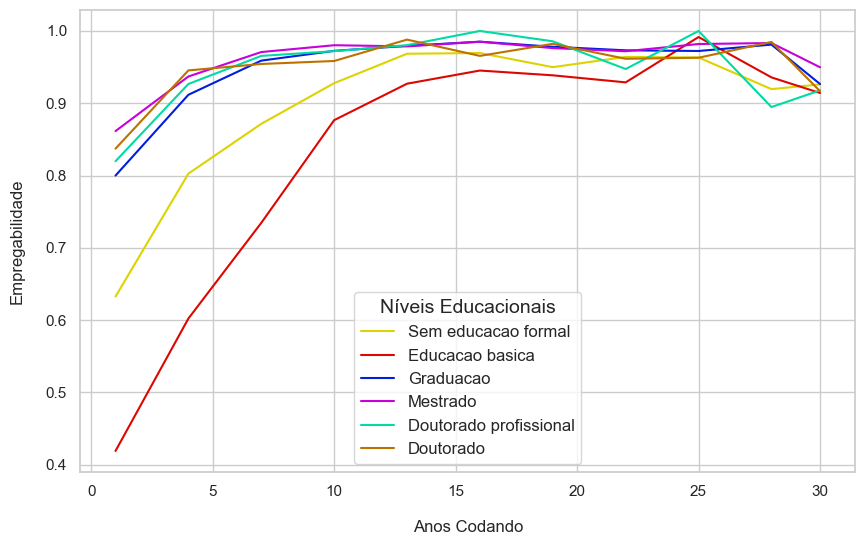
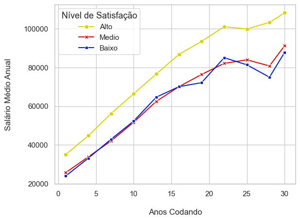

# A1-LP-2024

# PARA BAIXAR O DATASET E EXECUTAR O CÓDIGO, BASTA BAIXAR O DATAFRAME "survey_results_public.csv" NO LINK ABAIXO E COLOCÁ-LO NA PASTA `\data` COM O NOME "survey_results_public.csv", APÓS ISSO, BASTA EXECUTAR O ARQUIVO `main.py` PARA VERIFICAR O CÓDIGO FONTE E `tests_main.py` PARA VERIFICAR OS TESTES. LEMBRE DE VERIFICAR O ARQUIVO `requirements.txt` COM AS BIBLIOTECAS E VERSÕES DO PYTHON NECESSÁRIAS. O PAPER ESTÁ NA PASTA `\paper`.

# LINK: https://www.kaggle.com/datasets/stackoverflow/stack-overflow-2018-developer-survey

## Alunos e matrículas:
José Thevez Gomes Guedes, 241708005
Isaías Gouvêa Gonçalves, 241708012
Henrique Gabriel Gasparelo, 241708055
Davi de França Vasconcelos Nunes, 241708053

## Código fonte

Nesta seção, iremos descrever as funcionalidades, propostas e detalhes de cada módulo do código fonte. No total, foram desenvolvidos 6 módulos, que fornecem a manipulação do dataframe, o tratamento dos dados, a preparação para visualização e a geração dos dataframes de cada hipótese. Todas essas ferramentas foram fundamentais para as visualizações gráficas e organização dos dados, como será descrito a seguir.

### Main

Este módulo apenas importa todos os módulos de plotagem e imprime as visualizações de cada gráfico de cada hipótese.

### Manipulação do CSV

Este módulo, intitulado `manipulacao_csv.py`, possui funções que geram e manipulam o dataframe, a fim de torná-lo inicialmente organizado e filtrado para os tratamentos seguintes. O módulo define várias funções para tal propósito, entre elas:

`ler_csv`: Função que cria o dataframe a partir de um arquivo csv, usando funções da biblioteca `pandas` e manipulações de caminho dos arquivos.

`filtrar_colunas`: Função que filtra apenas as colunas escolhidas do dataframe, a fim de selecionar apenas os dados desejados.

`filtrar_linhas`: Função que filtra apenas as linhas que possuem os valores desejados, a fim de refinar os dados.

`filtrar_linhas_por_um_elemento_em_lista`: Função que filtra apenas as linhas que possuem um elemento desejado na respectiva lista.

### Tratamento dos Dados

Este módulo, intitulado `tratamento_dados.py`, é reponsável por definir funções que tratam os dados, lidando com valores faltantes, atípicos e descritos em listas, a fim de tornar o dataframe mais organizado e compatível com funções posteriores de visualização. O módulo define diversas funções, entre elas:

`tratamento_valores_faltantes`: Função que lida com os valores faltantes, decidindo se eles serão excluídos ou preenchidos a depender da hipótese e proposta do usuário.

`tratamento_valores_atípicos`: Função que exclui valores que são considerados "fora da curva", por serem muito grandes ou muito pequenos, e que prejudicam a análise, a função faz isso a partir de limites superior e inferior, decididos pelo usuário, e pela escolha de remover os valores zerados, também determinada pelo usuário.

`tratamento_lista_de_valores`: Função que transforma elementos que são listas no csv original em listas do python.

### Armazenamento de Dicionários

Este módulo, intitulado `armazenamento_dicionarios.py` apenas define dicionários em Python que servirão em funções posteriores para alterar a forma como os dados são visualizados, a fim de facilitar a plotagem e aumentar a organização do dataframe.

### Preparação para a Visualização

Este módulo, intitulado `preparacao_visualizacao`, possui diversas funções e finalidades, como alterar os dados para a visualização, gerar análises exploratórias, fazer cálculo de variáveis de correlação e criar colunas e índices novos com base em colunas escolhidas do dataframe original. Todas essas funcionalidades foram criadas com o intuito de tornar possível a visualização gráfica e permitir análises quantitativas profundas dos dados possuídos. Para isso, várias funções foram definidas, entre elas:

`modificar_dados_usando_dicionario`: Usando os dicionários do `armazenamento_dicionarios.py`, essa função altera os dados de uma coluna escolhida do dataframe, a fim de categorizar os dados e organizá-los para visualização.

`analise_unidimensional`: Função que, a partir de coluna escolhida, gera uma analise unidimensional completa da coluna, com Quantidade de Elementos, Média, Variância, Desvio Padrão, Mínimo, Primeiro Quartil, Mediana, Terceiro Quartil e Máximo, colocando todos esses dados em um dicionário.

`analise_bidimensional`: Função que calcula o coeficiente de correlação entre duas colunas, definido como a média dos produtos dos desvios de cada coluna, dividido pelo produto dos desvios padrão de cada coluna.

`criar_coluna_habitos_saudaveis`: Função que cria uma coluna que representa os hábitos saudáveis do programador, a partir da média das colunas que representam a Quantidade de Refeições Puladas, Número de Horas no Computador, Número de Horas do Lado de Fora e Frequência de Exercícios Físicos.

`calcular_empregabilidade`: Função que a partir de um dataframe dado, calcula a empregabilidade como a razão entre o número de programadores empregados e o número total de programadores.

`calcular_r2`: Função que calcula o r2 entre uma coluna quantitativa e uma qualitativa (r2 é definido com 1 - var_medio/variância dos dados, onde o var_medio é calculado como a média ponderada entre as variâncias em cada categoria, onde as frequências absolutas são os pesos).

### Dataframes das Hipóteses

Este módulo, intitulado `dataframes_hipoteses.py`, gera, usando as funções descritas nos tópicos anteriores, dataframes apenas com os dados necessários, já tratados e prontos para a visualização, para cada uma das hipóteses, que estão descritas no paper e rapidamente comentadas no tópico de Plotagens, a fim de facilitar a visualização e organizar a estrutura do código, incluindo, inclusive, modelos adicionais para algumas hipóteses, para eventuais mudanças criativas nas ideias para plotagem.

## Plotagens:

Nesta seção, apresentaremos as visualizações gráficas que ilustram os dados analisados para cada hipótese do projeto. As plotagens são ferramentas fundamentais para explorar e entender os padrões nos dados, facilitando a interpretação e extração de insights. Para cada hipótese, utilizaremos diferentes tipos de gráficos adequados para destacar as relações e tendências presentes.

* **Hipótese 1:** Índices de Hábitos Saudáveis entre Programadores.
  
  Para esta hipótese, utilizamos um heatmap (mapa de calor) onde o eixo X representa as faixas de anos de experiência e o eixo Y as linguagens de programação ("C", "Java", "JavaScript" e "Python"). O gradiente de cores reflete o índice de saúde, permitindo a visualização de como esse índice varia em função do tempo de experiência e da linguagem utilizada.

  Essa forma de visualização foi escolhida porque o uso do gradiente facilita a identificação de padrões. Assim, é possível obter uma visão clara de como diferentes grupos se comportam com relação ao índice de saúde conforme a experiência e a linguagem de programação.

  

  
* **Hipótese 2:** Crescimento Salarial entre Programadores de Python e Java/C
   
   Para a hipótese 2, utilizamos um gráfico de dispersão para analisar os dados salariais de programadores, divididos em grupos conforme as linguagens de programação em seu repertório: Python, JavaScript, C, Java ou aqueles que utilizam duas ou mais dessas linguagens. No gráfico, o eixo X representa os anos de experiência e o eixo Y o salário anual (em USD). Adicionamos uma linha de tendência para cada grupo, facilitando a comparação do crescimento salarial ao longo do tempo.

   A escolha do gráfico de dispersão foi feita porque ele permite uma análise clara da relação entre multivariáveis contínuas, no caso, o tempo de experiência e o salário. Além disso, a dispersão dos pontos proporciona uma visão detalhada das variações individuais dentro de cada grupo, enquanto as linhas de tendência auxiliam na identificação de padrões gerais de crescimento salarial ao longo do tempo.
 

  

* **Hipótese 3:** Grau de Formação e Empregabilidade.

   A escolha do gráfico de linhas para a hipótese 3 se justifica pela sua capacidade de representar visualmente dados contínuos e a evolução de variáveis ao longo do tempo. Neste contexto, utilizamos o gráfico para ilustrar a proporção de programadores empregados em relação ao total, categorizando-os conforme seu grau de formação. O eixo X representa a experiência em anos, enquanto o eixo Y quantifica a proporção de empregabilidade.
   
   Essa representação permite não apenas a observação de tendências e padrões na empregabilidade em diferentes níveis de formação, mas também a identificação de possíveis correlações entre a experiência e a empregabilidade. A suavização das linhas facilita a visualização das flutuações nos dados, permitindo uma análise mais clara de como cada grau de formação pode impactar a empregabilidade ao longo da carreira profissional.

  

 

* **Hipótese 4:** Formação Superior e Domínio de Linguagens de Programação.

Para a hipótese 4, utilizamos um gráfico de linhas com marcadores para investigar a relação entre a satisfação na carreira e os níveis salariais de programadores. Os dados foram organizados com base nos anos de experiência e divididos em três grupos conforme os níveis de satisfação profissional (alta, média e baixa). No gráfico, o eixo X representa os anos de experiência e o eixo Y mostra o salário médio. As três linhas correspondem aos níveis de satisfação, permitindo uma análise comparativa de como os salários evoluem ao longo da carreira em função da satisfação.

A escolha do gráfico de linhas se justifica por sua capacidade de representar tendências ao longo do tempo, facilitando a visualização das diferenças salariais entre os grupos. Essa abordagem permite identificar como a satisfação na carreira pode impactar o crescimento salarial ao longo da trajetória profissional.

  

 

## Testes:

Nesta seção, serão tratados os testes utilizados para verificar os principais métodos de nosso código. Todas as principais funções foram devidamente testadas e aplicadas em seu fim último com sucesso, mas por redundância, foram elaborados testes a fim de testar as funções em casos mais gerais e isolados que envolvam problemáticas semelhantes.

Todos os arquivos relacionados aos testes estão no diretório `\tests`. Nele estão contidos os arquivos `tests_main.py`,`tests_manip_csv.py`, `tests_prep_vizu.py`, `tests_trat_dados.py` e o subdiretório `arquivos_testes`  

**O arquivo `tests_main.py`** executa todos os demais testes de uma só vez. Basta executá-lo. 

Caso queira executar um determinado grupo de testes separado, há três opções:

**O arquivo `tests_manip_csv.py`** trata dos testes atrelados ao arquivo `src\manipulacao_csv.py`, que consiste em funções que tratam de receber um arquivo CSV e realizar sua leitura e conversão para um DataFrame em Pandas. Aqui são utilizados os arquivos do diretório `arquivos_testes`, que contem alguns arquivos em CSV com diferentes variações para que sejam testadas as capacidades de leitura e análise desses arquivos mediantes certas circunstâncias.

**O arquivo `tests_trat_dados.py`** trata dos testes atrelados ao arquivo `src\tratamento_dados.py` que contém funções que manipulam DataFrames Pandas para atualizar dados, limpá-los e permitir sua análise. 

**O arquivo `tests_prep_vizu.py`** trata dos testes atrelados ao arquivo `src\preparacao_visualizacao.py` que contém funções que, a partir das bases de dados preparadas, criam os indicadores utilizados na Análise Exploratória e na plotagem dos gráficos, que serão fundamentais para a conclusão do trabalho

